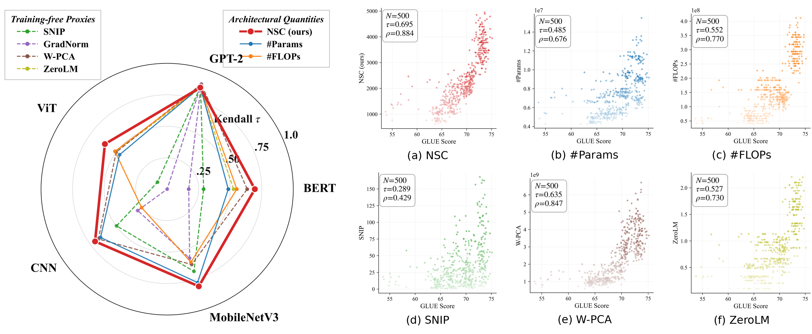
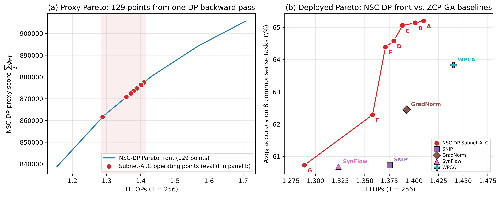

<div align="center">

# Neural Spectral Capacity

### Measuring and Designing Architectures from Network Specification Alone

Chenyu Zhu · Ruoyu Zhao · [Zhichao Lu](mailto:zhichao.lu@cityu.edu.hk)

Department of Computer Science, City University of Hong Kong

[](#citation)
[](LICENSE)
[](#installation)

</div>

---

**NSC** is a closed-form scalar that scores a Transformer (or CNN) architecture from its
specification alone: no model instantiation, no data, no gradients. Under standard random
initialization the Marchenko–Pastur law turns the singular-value spectrum of each weight
matrix into a deterministic function of its shape and initialization variance, so an entire
architecture is scored in microseconds on a CPU. Because NSC is additive across layers,
maximizing it under a resource budget is a bounded knapsack, which **NSC-DP** solves exactly
by dynamic programming in seconds, returning the architecture that *globally* maximizes NSC.

<p align="center">
  
  <br>
  <em><b>Figure 2.</b> Ranking quality of NSC against architectural quantities (#Params, #FLOPs) and
  training-free proxies across five architecture families. <b>Left:</b> Kendall τ on FlexiBERT, GPT-2,
  AutoFormer-Tiny, NATS-Bench-SSS and MobileNetV3. <b>Right:</b> six scoring functions against GLUE
  score on 500 BERT architectures from FlexiBERT, with Kendall τ and Spearman ρ annotated.</em>
</p>

## Highlights

- **Specification-only scoring.** NSC ranks architectures more accurately than #Params, #FLOPs and
  training-free proxies (W-PCA, ZeroLM, SNIP, GradNorm) across seven Transformer and CNN families.
  On FlexiBERT it keeps τ = 0.505 on architecture pairs whose #Params differ by less than 10 %, where
  #Params collapses to τ = 0.082.
- **Exact search in seconds.** NSC-DP finds a Transformer-XL architecture on WikiText-103 that beats
  the human-designed baseline in 2 s on one CPU core, over 400× faster than proxy-driven
  evolutionary search.
- **Calibration-free LLM pruning.** NSC-DP prunes LLaMA-7B to the best 5.7 B model across eight
  commonsense-reasoning tasks without any calibration data, ~5,900× faster than the strongest
  training-free proxy baseline; a single DP backward pass yields the whole accuracy–TFLOPs Pareto front.

## Method in one paragraph

For a weight matrix $W \in \mathbb{R}^{m \times n}$ with singular values $\sigma_i$, the
spectral capacity is

$$\psi(W) = \ln\det\left(I + W^{\top}W\right) = \sum_{i=1}^{\min(m,n)} \ln\left(1 + \sigma_i^{2}\right).$$

When $W$ has i.i.d. entries of variance $s^{2}$, the empirical spectrum of $W^{\top}W$ converges to the
Marchenko–Pastur law, and $\psi(W)$ converges to a closed-form quantity that depends only on
$(m, n, s)$:

$$\psi_{\mathrm{MP}}(m, n, s) = N \int_{\lambda_-}^{\lambda_+} \ln\left(1 + M s^{2}\lambda\right) f_{\mathrm{MP}}(\lambda;\gamma)\, d\lambda,
\qquad N = \min(m,n),\; M = \max(m,n),\; \gamma = N/M.$$

The NSC of an architecture is the sum of $\psi_{\mathrm{MP}}$ over all its weight matrices
(attention decomposed per head). The sum decomposes over layers, so for a resource budget $B$

$$\max_{x_1,\dots,x_L}\ \sum_{l=1}^{L} \Psi_l(x_l) \quad \text{s.t.} \quad \sum_{l=1}^{L} c_l(x_l) \le B$$

is a bounded knapsack over per-layer choices $x_l$ (FFN width, head count, LoRA rank, ...), which
NSC-DP solves exactly by dynamic programming on a cached $\psi_{\mathrm{MP}}$ table. The reference
implementation of $\psi_{\mathrm{MP}}$ is [`nsc/nsc_utils.py`](nsc/nsc_utils.py).

## Results

### Ranking on FlexiBERT (500 BERT architectures, GLUE)

| Method | τ | 10 %-PW τ | Time (500 archs) |
|---|:---:|:---:|---:|
| **NSC (ours)** | **0.695** | **0.505** | **2 ms** (CPU) |
| #Params | 0.485 | 0.082 | — |
| #FLOPs | 0.552 | 0.329 | 2 ms (CPU) |
| W-PCA | 0.635 | 0.417 | 88 s (A100) |
| ZeroLM | 0.527 | 0.355 | 63 s (A100) |
| SNIP | 0.289 | 0.237 | 73 s (A100) |
| GradNorm | 0.171 | 0.164 | 74 s (A100) |

*10 %-PW: Kendall τ restricted to architecture pairs whose #Params differ by less than 10 %.*

### Architecture search with NSC-DP

<table>
<tr>
<th colspan="4">Transformer-XL · WikiText-103</th>
<th colspan="5">AutoFormer-Tiny · ImageNet-1K</th>
</tr>
<tr>
<th>Method</th><th>#P (M)</th><th>Test PPL ↓</th><th>Cost</th>
<th>Method</th><th>#P (M)</th><th>Acc@1 ↑</th><th>Acc@5 ↑</th><th>Cost</th>
</tr>
<tr><td>TXL Base</td><td>38</td><td>23.279</td><td>—</td>
    <td>AutoFormer-T</td><td>5.7</td><td><b>75.308</b></td><td>92.690</td><td>24 d</td></tr>
<tr><td>Synaptic Div.</td><td>37</td><td>23.135</td><td>903 s</td>
    <td>TF-TAS</td><td>5.9</td><td>75.234</td><td>92.730</td><td>0.5 d</td></tr>
<tr><td>Softmax Conf.</td><td>39</td><td>23.532</td><td>883 s</td>
    <td>AZ-NAS</td><td>5.9</td><td>74.804</td><td>92.504</td><td>2,592 s</td></tr>
<tr><td>W-PCA</td><td>40</td><td>23.669</td><td>965 s</td>
    <td>W-PCA</td><td>5.8</td><td>74.752</td><td>92.500</td><td>206 s</td></tr>
<tr><td><b>NSC-DP (ours)</b></td><td>40</td><td><b>23.087</b></td><td><b>2.0 s</b></td>
    <td><b>NSC-DP (ours)</b></td><td>5.8</td><td>75.276</td><td><b>92.788</b></td><td><b>0.03 s</b></td></tr>
</table>

*#P: non-embedding parameters. Baselines run on GPU; NSC-DP runs on a single CPU core.*

### Structured pruning of LLaMA-7B (LoNAS SuperNet, 6.7 B → 5.7 B)

| Method | Params | BoolQ | PIQA | SIQA | HSwag | WGrnd | ARC-e | ARC-c | OBQA | **Avg₈** | Cost |
|---|:---:|:---:|:---:|:---:|:---:|:---:|:---:|:---:|:---:|:---:|---:|
| LoNAS-SuperNet (unpruned) | 6.7 B | 66.02 | 77.58 | 72.93 | 57.49 | 66.85 | 78.41 | 62.29 | 76.20 | 69.72 | — |
| SNIP | 5.4 B | 61.93 | 69.21 | 64.99 | 41.26 | 62.04 | 66.50 | 52.47 | 67.40 | 60.73 | 22 min |
| SynFlow | 5.2 B | 61.13 | 70.24 | 63.25 | 45.94 | 59.98 | 66.84 | 51.88 | 66.20 | 60.68 | 23 min |
| GradNorm | 5.5 B | 61.31 | 70.78 | 67.35 | 46.33 | 62.59 | 69.02 | 55.03 | 67.20 | 62.45 | 22 min |
| W-PCA | 5.7 B | 63.82 | 70.95 | 67.91 | 49.24 | 62.75 | 69.57 | 56.40 | 70.00 | 63.83 | 45 min |
| **NSC-DP (ours)** | 5.7 B | **64.01** | **72.85** | **68.94** | **51.30** | **64.72** | **72.43** | **58.70** | **70.80** | **65.47** | **0.5 s** |

*Baselines use the pretrained weights and a WikiText-103 calibration mini-batch as the fitness of an
evolutionary search (1,000 proxy evaluations); NSC-DP uses neither.*

<p align="center">
  
  <br>
  <em><b>Figure 3.</b> Pareto front from a single NSC-DP run. Avg₈ commonsense reasoning vs. TFLOPs
  (at T = 256) for seven LoNAS-LLaMA-7B operating points (A–G), all read from the same 0.46 s DP
  backward pass.</em>
</p>

## Installation

```bash
git clone https://github.com/Optima-CityU/neural-spectral-capacity.git
cd neural-spectral-capacity
pip install numpy scipy matplotlib torch torchvision timm transformers peft thop
export PYTHONPATH=nsc:ranking:search/txl:search/autoformer:pruning_lonas:appendix
```

Python ≥ 3.9. Scoring an architecture with NSC needs only `numpy` and `scipy`:

```python
from nsc_utils import psi_mp, xavier_sigma

d_model, d_ff = 512, 2048
psi = 2 * psi_mp(d_ff, d_model, xavier_sigma(d_ff, d_model))   # one FFN block (up + down projection)
```

Benchmark data, datasets and model weights are not included (see [External resources](#external-resources)).
Their locations are read from environment variables:

| Variable | Meaning | Default |
|---|---|---|
| `NSC_ROOT` | root of the benchmark data tree; small proxy input batches go in `$NSC_ROOT/sample_inputs/` | `.` |
| `NSC_OUT` | where results and figures are written | `outputs` |
| `FLEXIBERT_DIR` | FlexiBERT code + `BERT_benchmark.json` | `FlexiBERT` |
| `AUTOFORMER_DIR` | checkout of microsoft/Cream `AutoFormer/` | `Cream/AutoFormer` |
| `AUTOFORMER_CKPT_DIR` | `supernet-{tiny,small,base}.pth` | `checkpoints` |
| `IMAGENET_DIR` | ImageNet-1K | `data/imagenet` |
| `LLAMA_PATH` | LLaMA-7B (HF format) | `yahma/llama-7b-hf` |
| `LONAS_ADAPTER` | the LoNAS LLaMA-7B commonsense adapter | `lonas-llama-7b-adapter` |
| `LONAS_DATA_DIR` | the eight commonsense-reasoning evaluation sets | `datasets` |

## Repository layout

```
nsc/               nsc_utils.py — reference ψ_MP implementation
ranking/           NSC scores on five architecture families; baseline scores
                   (#FLOPs, W-PCA, ZeroLM, SNIP, GradNorm, SynFlow)
search/txl/        NSC-DP on Transformer-XL (WikiText-103), EA baselines, training
search/autoformer/ NSC-DP on AutoFormer (ImageNet-1K)
pruning_lonas/     LLaMA-7B pruning via the LoNAS supernet: NSC-DP, proxy + GA baselines,
                   Avg-8 commonsense evaluation
appendix/          aggregation choice, MP finite-size convergence, init-variance robustness,
                   concavity of ψ_MP
```

## Reproducing the paper

**Method**
- ψ_MP: `nsc/nsc_utils.py`

**Ranking across architecture families (§4.1, Figure 2)**
- NSC scores: `ranking/compute_flexibert.py`, `compute_gpt2.py`, `compute_autoformer.py`,
  `compute_nats_sss.py`, `compute_mnv3.py`
- Baselines: `ranking/compute_flops_all.py` (#FLOPs); `ranking/run_realdata_proxy.py`
  (W-PCA, ZeroLM, SNIP, GradNorm, SynFlow), which uses the per-family proxy implementations in
  `ranking/eval_all_zcps.py` (FlexiBERT), `ranking/eval_gpt2_baselines.py` (GPT-2) and
  `ranking/eval_autoformer_tiny.py` (AutoFormer)
- FlexiBERT, NSC and all training-free proxies (per-architecture hidden size, per-layer FFN
  widths): `ranking/eval_flexibert.py`

**Architecture search via NSC-DP (§4.2)**
- Transformer-XL: `search/txl/search_txl_space.py` (search space and DP),
  `search/txl/nsc_dp_search.py` (NSC-DP), `search/txl/run_independent_ea.py` (EA baselines),
  `search/txl/train_wt103_txl.py` (training on WikiText-103; requires kimiyoung/transformer-xl)
- AutoFormer: `search/autoformer/nsc_dp_autoformer.py` (NSC-DP); the returned subnets are evaluated
  with the AutoFormer supernet evaluation in microsoft/Cream

**Structured pruning of LLaMA-7B (§4.3, Figure 3, multi-budget appendix)**
- NSC-DP: `pruning_lonas/build_nsch_mp_cache.py` → `lonas_nscdp_full_pareto.py`;
  TFLOPs-constrained Pareto front (operating points A–G): `lonas_nscdp_tflops_dp.py`;
  search space and DP core: `lonas_nscdp_original_space.py`
- Baselines (proxy + GA): `pruning_lonas/run_zcp_baselines_full.py`
- Avg-8 evaluation: `pruning_lonas/lonas_eval_unified_table_avg8.py`
  (with `lonas_eval_unified_table.py`, `bench_eval_500.py`)

**Appendix ablations**
- Aggregation choice: `appendix/ablation_aggregation_specfaithful.py`, `ablation_min_generalization.py`,
  `aggregation_autoformer.py` (aggregation functions in `appendix/ablation_aggregation.py`)
- MP finite-size convergence: `appendix/ablation_mp_convergence.py`
- Robustness to initialization convention: `appendix/ablation_init_variance.py`
- Concavity of ψ_MP: `appendix/plot_psi_concavity.py`

## External resources

- **FlexiBERT**: `BERT_benchmark.json` and the ELECTRA modeling code from the [FlexiBERT](https://github.com/jha-lab/txf_design-space) release.
- **GPT-2 / LiteTransformerSearch**: `gpt2_benchmark.json` from [LiteTransformerSearch](https://github.com/microsoft/archai).
- **AutoFormer**: [microsoft/Cream](https://github.com/microsoft/Cream/tree/main/AutoFormer) (AutoFormer), supernet checkpoints, the 1k-architecture sets; ImageNet-1K.
- **NATS-Bench-SSS**: the official [NATS-Bench](https://github.com/D-X-Y/NATS-Bench) size-search-space results.
- **MobileNetV3**: [OFA](https://github.com/mit-han-lab/once-for-all) MobileNetV3 accuracy table.
- **Transformer-XL**: [kimiyoung/transformer-xl](https://github.com/kimiyoung/transformer-xl); WikiText-103.
- **LoNAS**: LLaMA-7B and the [IntelLabs LoNAS](https://github.com/IntelLabs/Hardware-Aware-Automated-Machine-Learning/tree/main/LoNAS) commonsense adapter; the eight commonsense
  tasks (BoolQ, PIQA, SIQA, HellaSwag, WinoGrande, ARC-e, ARC-c, OBQA).

## Citation

```bibtex
@article{zhu2026nsc,
  title   = {Neural Spectral Capacity: Measuring and Designing Architectures from Network Specification Alone},
  author  = {Zhu, Chenyu and Zhao, Ruoyu and Lu, Zhichao},
  journal = {arXiv preprint},
  year    = {2026}
}
```

## License

This project is released under the [MIT License](LICENSE).
